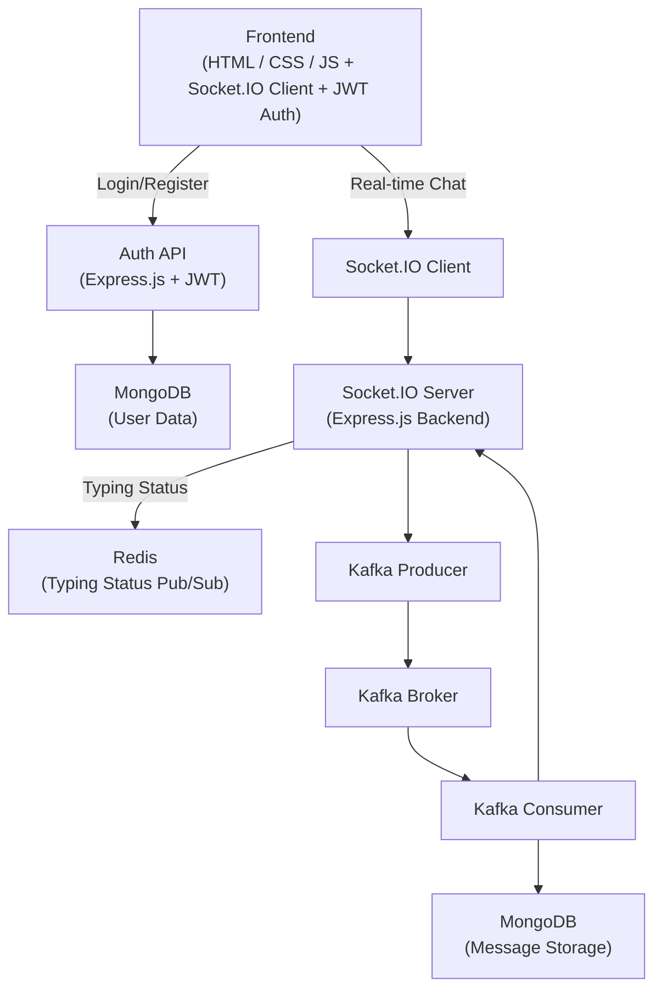

## 📡 Real-time Chat Application

A full-stack real-time chat application built using **Node.js**, **Express**, **Socket.IO**, **MongoDB**, **Kafka**, and **Redis**.

---

## 🚀 Features

- 🔐 **User Authentication**  
  Secure registration and login using JWT and bcryptjs.

- 🖥️ **Separate Interfaces**  
  Dedicated pages for authentication and chat.

- ⚡ **Real-time Messaging**  
  Instant message delivery using Socket.IO.

- 💾 **Message Persistence**  
  Messages are stored in MongoDB via Kafka for durability and analytics.

- 🖼️ **Media Sharing**  
  Send and receive images/GIFs via Base64 encoding.

- ⌨️ **Typing Indicators**  
  Real-time "User is typing..." notifications using Redis Pub/Sub.

- 🔓 **Logout**  
  Easily clear user session.

- 🧱 **Scalable Architecture**  
  Kafka integration for decoupled and scalable message processing.

---

## 🛠️ Tech Stack

### Backend
- Node.js
- Express.js
- Socket.IO
- Mongoose
- KafkaJS
- Redis
- JWT (jsonwebtoken)
- bcryptjs
- body-parser

### Databases
- MongoDB
- Redis

### Message Broker
- Apache Kafka

### Frontend
- HTML5
- CSS3
- JavaScript
- Socket.IO Client

---

## 📦 Prerequisites

Make sure you have the following installed:

- Node.js (LTS)
- npm
- Docker Desktop
- Git

---

## 🧰 Setup Instructions

### 1. Clone the repository
```bash
git clone https://github.com/your-username/chatapp.git
cd chatapp
```

### 2. Install backend dependencies
```bash
cd server
npm install
```

### 3. Start services with Docker
```bash
docker-compose up
```

### 4. Start the backend server
```bash
node index.js
```

### 5. Launch the frontend
Open `client/index.html` in your browser.

---

## 📁 Folder Structure

```
Chatapp/
│
├── client/            # Frontend HTML/CSS/JS files
│   ├──auth.html
|   ├──index.html
|   ├──main.js
|   └── style.css
|
├── server/
│   ├── kafka/
│   │   ├── producer.js
│   │   └── consumer.js
│   │
│   ├── models/
│   │   └── Message.js
│   │
│   ├── routes/
│   │   └── auth.js
│   │
│   ├── middleware/
│   │   └── auth.js
│   │
│   ├── redis/
│   │   └── index.js
│   │
│   └── index.js        # Main server file
│
└── docker-compose.yml  # Containers for Kafka, Redis, MongoDB
```


## 🧠 Architecture Flow



---


https://github.com/user-attachments/assets/baba68e2-5d05-45bc-92b1-eedca265895a


---


